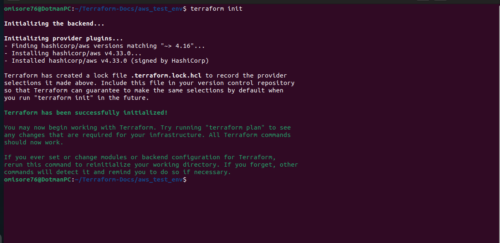
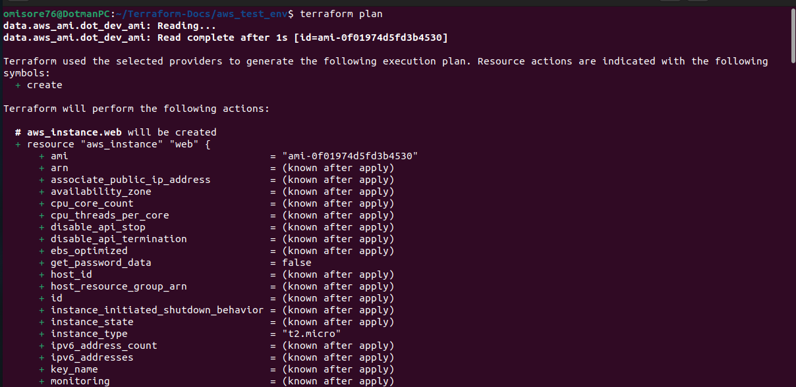
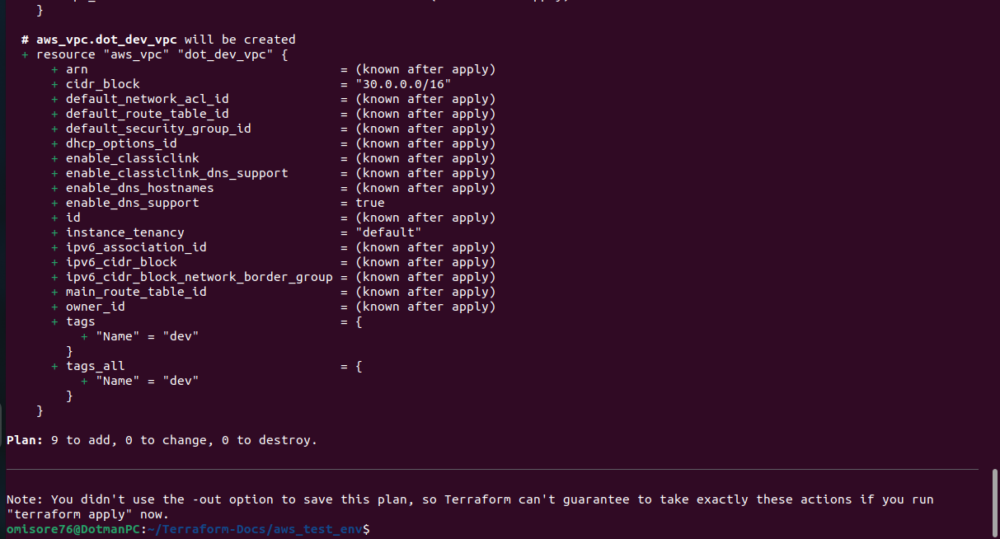
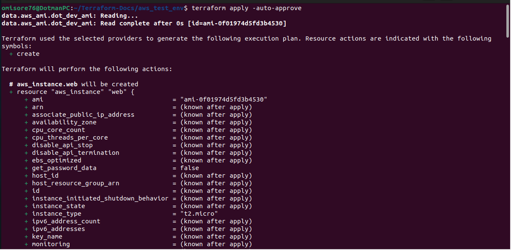
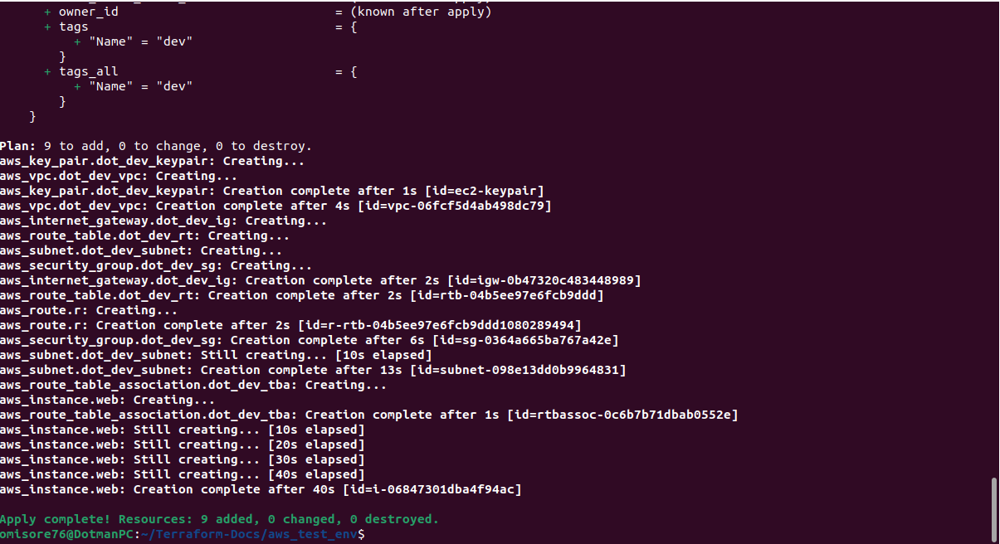
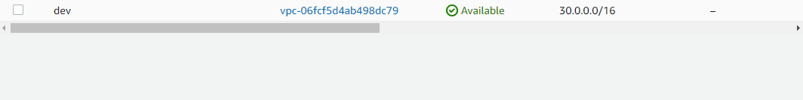
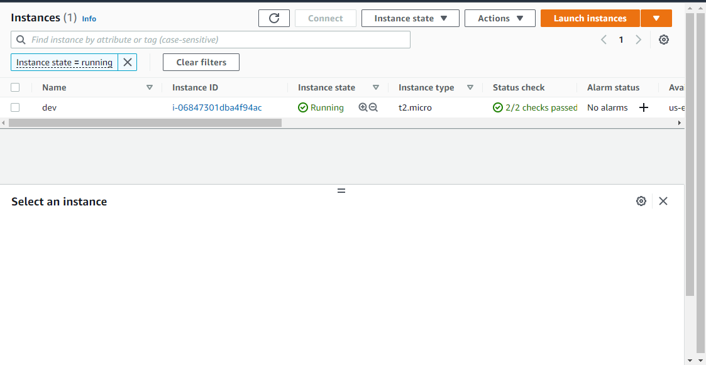
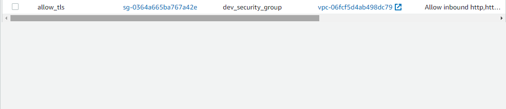
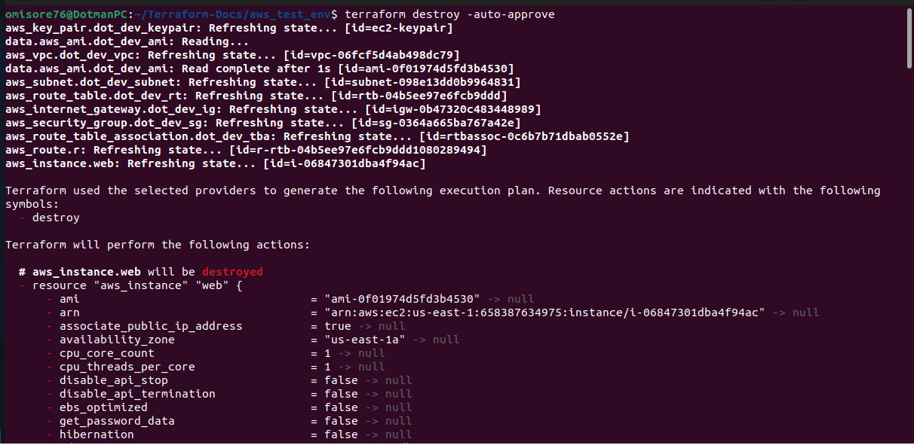
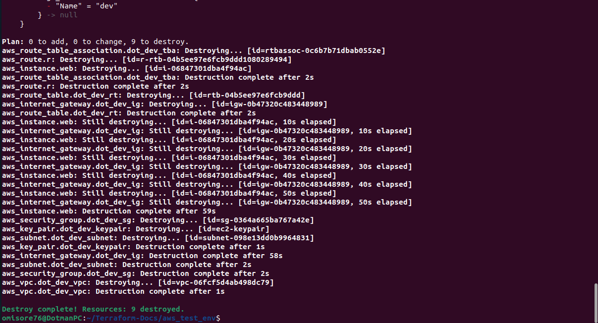

# aws_vpc_test_env

## Project Description
This repo contains a set of code that allows you to build a test environment on **AWS** using **terraform.** The test environment consists of a **VPC, public subnet, internet gateway, route table, security group, keypair, and amazon EC2 instance.**

With everything properly configured, you will be introduced to some key concepts of terraform. Terraform is an infrastructure as code tool that enables you to define your infrastructure using code. This allows you to manage your infrastructure in a controlled and consistent manner.

In addition to the basics of setting up a test environment, this repo will also show you how to launch an EC2 instance. This instance can be used to test your code and applications.

### Why Use Terraform
There are many reasons for using Terraform as Infrastructure as a code. 
- Terraform allows you to define your infrastructure in a declarative way, meaning you describe what you want and Terraform will figure out how to create it. This can be very useful when dealing with complex infrastructure. 

- Additionally, Terraform is highly extensible, so if you need to add new functionality or customize existing functionality, you can do so easily. 

- Finally, Terraform is an open source project with a strong community

## Prerequisite

There are a few things you need before you can use this repo:

1) An AWS account with admin priviledges. You can learn how to create an AWS account [HERE](https://docs.aws.amazon.com/polly/latest/dg/setting-up.html).

2) AWS CLI set up on a local machine. You can learn how to set up AWS CLI [HERE](https://docs.aws.amazon.com/cli/latest/userguide/cli-configure-quickstart.html).

3) A good understanding of cloud fundamentals and some experience creating services in a public cloud, AWS in this case.

4) Terraform installed on a local machine. You can learn how to install Terraform [HERE](https://learn.hashicorp.com/tutorials/terraform/install-cli).

5) Git installed on a local machine. Learn how to install git [HERE](https://github.com/git-guides/install-git)

## How to Use the Project

This project can be used by following these steps:
1) Fork the repo

2) Clone it to your local machine

3) Generate a new keypair by running the command: `ssh-keygeb -t ed25519`. You will be prompted to enter the location to save the key. Type `~/.ssh/ec2_keypair`

4) Run `terraform init`

5) Run `terraform plan`

6) Run `terraform apply -auto-approve`

If you check your AWS dashboard, you'll see that a VPC, public subnet, internet gateway, route table, security group, keypair, and Amazon EC2 instance have all been created.

Finally, it's important to destroy resources when you're done with them, in order to avoid incurring unnecessary charges. The `terraform destroy -auto-approve` command is a quick and easy way to destroy all resources that have been created. Simply run the command and all resources will be destroyed.

## Helpful Tips
Hey! Here are some helpful tips:
You can choose any location and name for your keypair. If you do this, you'll need to specify the file path in the **"aws_key_pair"** resource block.

Modify the userdata file to suit your needs.

And of course, feel free to modify the template to suit your needs.

Thanks!

